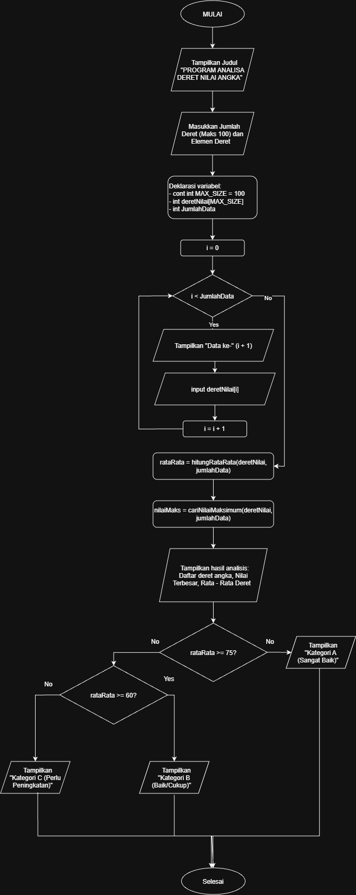

# Mini Project C++: Program Analisis Deret Nilai Angka

Repositori ini dibuat untuk memenuhi tugas mini project pemrograman menggunakan bahasa C++. Di sini, kita bikin program yang simpel tapi sudah memenuhi semua syarat wajib tugas, yaitu menggabungkan 5 elemen dasar pemrograman dalam satu kode program.

---     

## 📋 Fitur & Elemen Pemrograman yang Digunakan
Program pengolahan deret angka ini mencakup elemen-elemen berikut:
1. **Input / Output (`cin` & `cout`)**: Buat nampilin teks di terminal dan nerima input angka dari user.
2. **Perulangan (`for`)**: Dipakai buat ngulang proses input data ke array dan nampilin datanya lagi.
3. **Percabangan (`if-else`)**: Buat nentuin kategori status nilai (misal lulus atau tidak berdasarkan rata-rata).
4. **Fungsi Buatan Sendiri (`Function`)**: Ada fungsi khusus (`hitungRataRata` dan `cariNilaiMaksimum`) supaya kodenya lebih rapi dan modular.
5. **Array**: Wadah penyimpanan data deret angka dengan kapasitas maksimal sampai 100 data.

---

## 📷 Dokumentasi & Bukti Running Program

### 1. Flowchart Program


### 2. Hasil Running / Output Program di Terminal


---

## 💻 Source Code (`miniproject.cpp`)

Berikut adalah kode lengkap program yang ada di repositori ini:

```cpp
#include <iostream>
using namespace std;

// FUNGSI BUATAN SENDIRI: Buat ngitung rata-rata dari array
float hitungRataRata(int arr[], int n) {
    int total = 0;
    for (int i = 0; i < n; i++) {
        total += arr[i]; // Perulangan di dalam fungsi
    }
    return (float)total / n;
}

// FUNGSI BUATAN SENDIRI: Buat nyari nilai paling besar (maksimum)
int cariNilaiMaksimum(int arr[], int n) {
    int maks = arr[0];
    for (int i = 1; i < n; i++) {
        if (arr[i] > maks) { // Percabangan di dalam fungsi
            maks = arr[i];
        }
    }
    return maks;
}

int main() {
    // Deklarasi Variabel & Array
    const int MAX_SIZE = 100;
    int deretNilai[MAX_SIZE];
    int jumlahData;

    // Bagian Input & Perulangan
    cout << "========================================\n";
    cout << "   PROGRAM ANALISIS DERET NILAI ANGKA   \n";
    cout << "========================================\n";
    cout << "Masukkan jumlah data deret (maks 100): ";
    cin >> jumlahData;

    cout << "\n--- Masukkan Elemen Deret ---\n";
    for (int i = 0; i < jumlahData; i++) {
        cout << "Data ke-" << i + 1 << ": ";
        cin >> deretNilai[i]; // Nginput data satu-satu ke array pake for
    }

    // Pemanggilan Fungsi yang udah dibuat di atas
    float rataRata = hitungRataRata(deretNilai, jumlahData);
    int nilaiMaks = cariNilaiMaksimum(deretNilai, jumlahData);

    // Menampilkan Hasil Output Array & Perhitungan
    cout << "\n========================================\n";
    cout << "             HASIL ANALISIS             \n";
    cout << "========================================\n";
    cout << "Daftar Deret Angka yang Dimasukkan: ";
    for (int i = 0; i < jumlahData; i++) {
        cout << deretNilai[i] << " "; 
    }
    cout << endl;

    cout << "Nilai Terbesar  : " << nilaiMaks << endl;
    cout << "Rata-rata Deret : " << rataRata << endl;

    // Percabangan (If-Else) buat nentuin kategori status
    cout << "Status Kategori : ";
    if (rataRata >= 75) {
        cout << "Kategori A (Sangat Baik / Lulus)" << endl;
    } else if (rataRata >= 60) {
        cout << "Kategori B (Baik / Cukup)" << endl;
    } else {
        cout << "Kategori C (Perlu Peningkatan)" << endl;
    }
    cout << "========================================\n";

    return 0;
}
